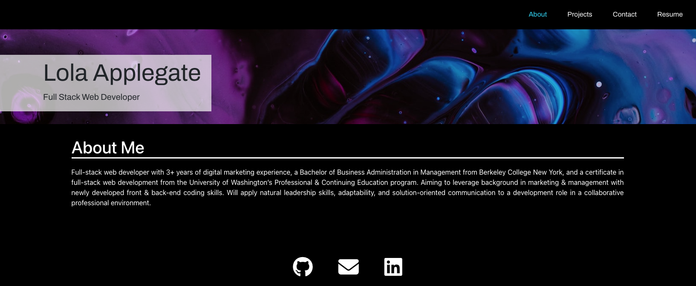
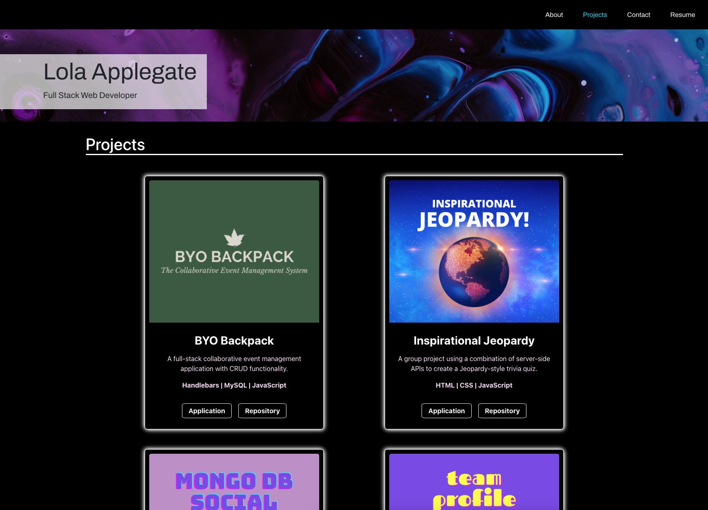
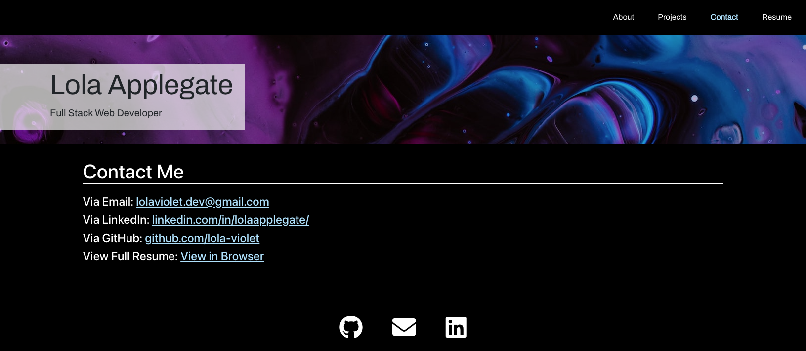
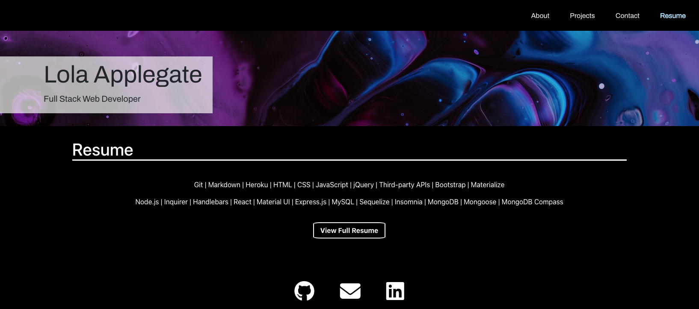

# React Portfolio

## Description
A professional portfolio created with React, displaying my brand statement, projects I've completed, contact information, and my resume.

---

## Table of Contents
* [Deployed Application](#deployed-application)
* [Usage](#usage)
* [Questions](#questions)

---

## Deployed Application
[React_Portfolio](https://lolaviolet-dev.herokuapp.com/)

---

## Usage
The navbar contains links to each page. On pageload, the default page is About Me. The projects tab contains my portfolio of work. Each project card contains a link to the deployed application & the github repository associated with that project. The contact tab contains a list of my current contact information. My contact information is also contained in the footer, where links can be accessed by clicking on the icons. The resume tab contains a list of my skills & a button to download my resume.

---

---

## Questions
View all of my projects on [GitHub](https://github.com/lola-violet).

If you have any questions or want to contribute, please contact me via email at [lolaviolet.dev@gmail.com](mailto:lolaviolet.dev@gmail.com).